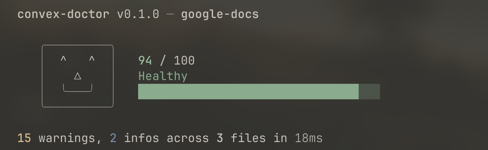

# convex-doctor



Diagnose your Convex backend for anti-patterns, security issues, and performance problems.

`convex-doctor` is a static analysis CLI for [Convex](https://convex.dev) projects. It parses your `convex/` directory, runs **72 rules across 7 categories**, and produces a weighted 0-100 health score. Think of it as ESLint, but purpose-built for Convex backends.

## Benchmarks

Tested against 18 open-source Convex applications

| Project | Stars | Score | Errors | Warnings | Info | Total |
|---------|------:|------:|-------:|---------:|-----:|------:|
| [google-docs](https://github.com/Davronov-Alimardon/google-docs) | 73 | 95/100 | 0 | 13 | 1 | 14 |
| [Ai-Website-Builder](https://github.com/Ratna-Babu/Ai-Website-Builder) | 124 | 93/100 | 0 | 12 | 1 | 13 |
| [miro-clone](https://github.com/sanidhyy/miro-clone) | 82 | 89/100 | 3 | 18 | 13 | 34 |
| [replicate](https://github.com/trestleinc/replicate) | 201 | 88/100 | 3 | 19 | 0 | 22 |
| [livecanvas](https://github.com/kaifcoder/livecanvas) | 192 | 86/100 | 3 | 28 | 0 | 31 |
| [quizzex](https://github.com/AnsellMaximilian/quizzex) | 1 | 82/100 | 3 | 61 | 4 | 68 |
| [notion-clone](https://github.com/adityaphasu/notion-clone) | 141 | 80/100 | 9 | 32 | 28 | 69 |
| [BloxAI](https://github.com/subhadeeproy3902/BloxAI) | 91 | 77/100 | 9 | 66 | 0 | 75 |
| [podcastr](https://github.com/adrianhajdin/podcastr) | 782 | 77/100 | 12 | 51 | 6 | 69 |
| [convjobs](https://github.com/mithileshchellappan/convjobs) | 2 | 76/100 | 6 | 47 | 4 | 57 |
| [convex-saas](https://github.com/get-convex/convex-saas) | 339 | 70/100 | 7 | 39 | 26 | 72 |
| [react-starter-kit](https://github.com/michaelshimeles/react-starter-kit) | 616 | 69/100 | 10 | 42 | 4 | 56 |
| [ticket-marketplace](https://github.com/sonnysangha/ticket-marketplace-saas-nextjs15-convex-clerk-stripe-connect) | 212 | 64/100 | 22 | 129 | 20 | 171 |
| [OpenChat](https://github.com/ajanraj/OpenChat) | 138 | 57/100 | 47 | 142 | 15 | 204 |
| [travel-planner-ai](https://github.com/hardikverma22/travel-planner-ai) | 241 | 55/100 | 34 | 165 | 9 | 208 |
| [youpac-ai](https://github.com/michaelshimeles/youpac-ai) | 314 | 54/100 | 49 | 172 | 118 | 339 |
| [opensync](https://github.com/waynesutton/opensync) | 310 | 47/100 | 70 | 256 | 58 | 384 |
| [markdown-site](https://github.com/waynesutton/markdown-site) | 550 | 41/100 | 73 | 245 | 48 | 366 |

*Benchmarks run on Feb 27, 2026 against each project's `main` branch. Sorted by score.*

## Installation

### npm (recommended)

```sh
# Run without installing
npx convex-doctor

# Or install globally
npm install -g convex-doctor
convex-doctor
```

### Download prebuilt binary

Grab the latest release for your platform from [GitHub Releases](https://github.com/nooesc/convex-doctor/releases/latest):

```sh
# macOS (Apple Silicon)
curl -L https://github.com/nooesc/convex-doctor/releases/latest/download/convex-doctor-aarch64-darwin -o convex-doctor
chmod +x convex-doctor && sudo mv convex-doctor /usr/local/bin/

# macOS (Intel)
curl -L https://github.com/nooesc/convex-doctor/releases/latest/download/convex-doctor-x86_64-darwin -o convex-doctor
chmod +x convex-doctor && sudo mv convex-doctor /usr/local/bin/

# Linux (x86_64)
curl -L https://github.com/nooesc/convex-doctor/releases/latest/download/convex-doctor-x86_64-linux -o convex-doctor
chmod +x convex-doctor && sudo mv convex-doctor /usr/local/bin/

# Linux (aarch64)
curl -L https://github.com/nooesc/convex-doctor/releases/latest/download/convex-doctor-aarch64-linux -o convex-doctor
chmod +x convex-doctor && sudo mv convex-doctor /usr/local/bin/
```

### Install from crates.io

```sh
cargo install convex-doctor
```

### Build from source

```sh
git clone https://github.com/nooesc/convex-doctor.git
cd convex-doctor
cargo build --release
# Binary is at ./target/release/convex-doctor
```

## Usage

Run from your project root (the directory containing `convex/`):

```sh
# Basic scan
convex-doctor

# Verbose output with file paths and line numbers
convex-doctor -v

# JSON output (for CI or tooling)
convex-doctor --format json

# Score only (prints just the number, e.g. "87")
convex-doctor --score

# Diff mode: only analyze files changed vs a base branch
convex-doctor --diff main
# Note: diff mode only runs file-level rules on changed files.

# Scan a specific project path
convex-doctor /path/to/my-project
```

## Rules

convex-doctor runs **72 rules** organized into **7 categories**. Each category carries a different weight in the final score.

| Category | Weight | Rules | Description |
|---|---|---|---|
| **Security** | 1.5x | 13 | Arg/return validators, auth checks, internal API misuse, secrets, CORS, access control, generic args |
| **Performance** | 1.2x | 13 | Unbounded collect, missing indexes, Date.now() in queries, loop mutations, N+1 patterns, pagination |
| **Correctness** | 1.5x | 20 | Unwaited promises, deprecated APIs, side effects in queries, scheduling/runtime/storage correctness |
| **Schema** | 1.0x | 9 | Missing schema, deep nesting, redundant indexes, search/index naming, optional field handling |
| **Architecture** | 0.8x | 8 | Large handlers, monolithic files, function chains, mixed types, missing helpers |
| **Configuration** | 1.0x | 5 | Missing convex.json, auth config, generated code, tsconfig, node version |
| **Client-Side** | 1.0x | 4 | Mutation in render, unhandled loading states, missing ConvexProvider |

### Rule reference

<details>
<summary><strong>Security</strong> (13 rules)</summary>

| Rule ID | Severity | What it detects |
|---|---|---|
| `security/missing-arg-validators` | error | Query/mutation/action and internal variants without `args` validators |
| `security/missing-return-validators` | warning | Public functions without `returns` validators |
| `security/missing-auth-check` | warning | Public functions that never call `ctx.auth.getUserIdentity()` |
| `security/internal-api-misuse` | error | Server-to-server calls using `api.*` instead of `internal.*` |
| `security/hardcoded-secrets` | error | API keys, tokens, or secrets hardcoded in source |
| `security/env-not-gitignored` | error | `.env.local` exists but is not in `.gitignore` |
| `security/spoofable-access-control` | warning | Access control trusting spoofable client args (e.g. `userId`, `role`) |
| `security/missing-table-id` | warning | Using string IDs instead of `v.id("table")` for document references |
| `security/missing-http-auth` | error | HTTP action endpoints without authentication checks |
| `security/conditional-function-export` | error | Convex functions conditionally exported based on environment |
| `security/generic-mutation-args` | warning | Public mutations using `v.any()` in argument validators |
| `security/overly-broad-patch` | warning | `ctx.db.patch` with spread args that bypass validation |
| `security/http-missing-cors` | warning | HTTP routes without CORS headers |

</details>

<details>
<summary><strong>Performance</strong> (13 rules)</summary>

| Rule ID | Severity | What it detects |
|---|---|---|
| `perf/unbounded-collect` | error | `.collect()` without `.take(n)` limit |
| `perf/filter-without-index` | warning | `.filter()` calls that scan entire tables |
| `perf/date-now-in-query` | error | `Date.now()` in query functions (breaks caching) |
| `perf/loop-run-mutation` | error | `ctx.runMutation`/`ctx.runQuery` inside loops (N+1) |
| `perf/sequential-run-calls` | warning | Multiple sequential `ctx.run*` calls in an action |
| `perf/unnecessary-run-action` | warning | `ctx.runAction` called from within an action |
| `perf/helper-vs-run` | warning | `ctx.runQuery`/`ctx.runMutation` inside a query or mutation |
| `perf/missing-index-on-foreign-key` | warning | `v.id("table")` field in schema without a corresponding index |
| `perf/action-from-client` | warning | Client calling actions directly instead of mutations |
| `perf/collect-then-filter` | warning | `.collect()` followed by JS `.filter()` instead of using DB query filters |
| `perf/large-document-write` | info | Inserting documents with 20+ fields in a single write |
| `perf/no-pagination-for-list` | warning | Public query with `.collect()` returning unbounded results to client |
| `perf/missing-pagination-opts-validator` | warning | `.paginate(...)` used without `paginationOptsValidator` in function args |

</details>

<details>
<summary><strong>Correctness</strong> (20 rules)</summary>

| Rule ID | Severity | What it detects |
|---|---|---|
| `correctness/unwaited-promise` | error | `ctx.db.insert`, `ctx.runMutation`, etc. without `await` |
| `correctness/old-function-syntax` | warning | Legacy function registration syntax |
| `correctness/db-in-action` | error | Direct `ctx.db.*` calls inside actions |
| `correctness/deprecated-api` | warning | Usage of deprecated Convex APIs (`v.bigint()`) |
| `correctness/wrong-runtime-import` | warning | Incompatible runtime imports (Node in edge, browser in server) |
| `correctness/direct-function-ref` | warning | Direct function refs passed to `ctx.run*` instead of `api.*`/`internal.*` |
| `correctness/missing-unique` | warning | `.first()` on indexed query where `.unique()` may be appropriate |
| `correctness/query-side-effect` | error | Side effects (`ctx.db.insert/patch/delete`) inside query functions |
| `correctness/mutation-in-query` | error | `ctx.runMutation` called from within a query function |
| `correctness/cron-uses-public-api` | error | Cron jobs referencing public `api.*` instead of `internal.*` |
| `correctness/node-query-mutation` | error | Queries/mutations defined in `"use node"` files |
| `correctness/scheduler-return-ignored` | info | `ctx.scheduler.runAfter` return value not captured |
| `correctness/non-deterministic-in-query` | warning | `Math.random()`, `new Date()`, `crypto` in query functions |
| `correctness/replace-vs-patch` | info | `ctx.db.replace` semantics reminder (full document replacement) |
| `correctness/generated-code-modified` | error | Generated files (`_generated/`) appear to be manually modified |
| `correctness/unsupported-validator-type` | error | Unsupported validator usage (`v.map()`, `v.set()`) |
| `correctness/query-delete-unsupported` | error | Unsupported query-chain `.delete()` usage |
| `correctness/cron-helper-method-usage` | warning | Use of deprecated cron helper methods (`hourly`/`daily`/`weekly`) |
| `correctness/cron-direct-function-reference` | error | Cron methods passed direct function identifiers instead of generated references |
| `correctness/storage-get-metadata-deprecated` | warning | Deprecated `ctx.storage.getMetadata` usage |

</details>

Additional parser diagnostic:

| Rule ID | Severity | What it detects |
|---|---|---|
| `correctness/file-parse-error` | error | A file failed to parse, so normal rules could not run on it |

This diagnostic is emitted by the engine when parsing fails and is not counted in the 72 registered rules.

<details>
<summary><strong>Schema</strong> (9 rules)</summary>

| Rule ID | Severity | What it detects |
|---|---|---|
| `schema/missing-schema` | warning | No `schema.ts` file found in `convex/` directory |
| `schema/deep-nesting` | warning | Schema validators nested more than 3 levels deep |
| `schema/array-relationships` | warning | `v.array(v.id(...))` patterns that may grow unbounded |
| `schema/redundant-index` | warning | Index that is a prefix of another index on the same table |
| `schema/too-many-indexes` | info | Table with 8+ indexes (limit is 32) |
| `schema/missing-search-index-filter` | info | Search index without `filterFields` |
| `schema/optional-field-no-default-handling` | warning | 5+ optional schema fields without undefined handling |
| `schema/missing-index-for-query` | warning | Query filters on a field with no matching index |
| `schema/index-name-includes-fields` | warning | Index name does not include all indexed fields in order (`by_field1_and_field2`) |

</details>

<details>
<summary><strong>Architecture</strong> (8 rules)</summary>

| Rule ID | Severity | What it detects |
|---|---|---|
| `arch/large-handler` | warning | Handler functions exceeding 50 lines |
| `arch/monolithic-file` | warning | Files with more than 10 exported functions |
| `arch/duplicated-auth` | warning | 3+ functions with inline auth checks in the same file |
| `arch/action-without-scheduling` | info | Actions that could use `ctx.scheduler` instead of direct calls |
| `arch/no-convex-error` | info | `throw new Error(...)` instead of `throw new ConvexError(...)` |
| `arch/mixed-function-types` | info | File mixing public and internal function exports |
| `arch/no-helper-functions` | info | Multiple large handlers with no shared helper functions |
| `arch/deep-function-chain` | warning | Action with 5+ `ctx.run*` calls forming a deep chain |

</details>

<details>
<summary><strong>Configuration</strong> (5 rules)</summary>

| Rule ID | Severity | What it detects |
|---|---|---|
| `config/missing-convex-json` | warning | No `convex.json` found in project root |
| `config/missing-auth-config` | error | Functions use `ctx.auth` but no `auth.config.ts` exists |
| `config/missing-generated-code` | warning | No `_generated/` directory found |
| `config/outdated-node-version` | warning | Node version in config is outdated |
| `config/missing-tsconfig` | info | No `tsconfig.json` found in convex directory |

</details>

<details>
<summary><strong>Client-Side</strong> (4 rules)</summary>

| Rule ID | Severity | What it detects |
|---|---|---|
| `client/mutation-in-render` | error | Mutation invocation during render (e.g. `useMutation(...)(...)`) |
| `client/unhandled-loading-state` | warning | `useQuery` result used without checking for `undefined` loading state |
| `client/action-instead-of-mutation` | info | `useAction` used where `useMutation` may suffice |
| `client/missing-convex-provider` | info | Convex hooks used without `ConvexProvider` in component tree |

</details>

## Scoring

The health score ranges from 0 to 100. Each finding deducts points based on its severity and category weight, with per-rule caps to prevent a single noisy rule from dominating the score.

| Score | Label | Meaning |
|---|---|---|
| 85 - 100 | Healthy | Few or no issues detected |
| 70 - 84 | Needs attention | Some issues worth addressing |
| 50 - 69 | Unhealthy | Significant problems found |
| 0 - 49 | Critical | Serious issues requiring immediate attention |

## Configuration

Create a `convex-doctor.toml` in your project root to customize behavior:

```toml
# Disable specific rules
[rules]
"security/missing-return-validators" = "off"
"arch/monolithic-file" = "off"

# Ignore files by glob pattern
[ignore]
files = [
  "convex/_generated/**",
  "convex/testHelpers.ts",
]

# CI: exit with code 1 if score is below threshold
[ci]
fail_below = 70

# Convex guidance behavior
[convex]
guidance_version = "v0.241.0"
strictness = "tiered" # tiered | strict | low_noise
```

Use `scripts/update-convex-guidance.sh [version]` to refresh pinned Convex guidance files in `reference/convex/`.
Examples: `scripts/update-convex-guidance.sh` or `scripts/update-convex-guidance.sh v0.242.0`.
The updater re-generates `reference/convex/coverage_matrix.toml` from the new guidance and carries forward prior enforceable mappings when bullet text still matches. The matrix is validated by `tests/convex_guidance_matrix_test.rs`.

## CI integration

### GitHub Actions

Add convex-doctor to your CI pipeline using the prebuilt binary (runs in ~2 seconds, no Rust toolchain needed):

```yaml
name: Convex Health Check
on: [pull_request]

jobs:
  convex-doctor:
    runs-on: ubuntu-latest
    steps:
      - uses: actions/checkout@v4

      - name: Install convex-doctor
        run: |
          curl -L https://github.com/nooesc/convex-doctor/releases/latest/download/convex-doctor-x86_64-linux -o convex-doctor
          chmod +x convex-doctor

      - name: Run convex-doctor
        run: ./convex-doctor
```

By default, convex-doctor exits with code 0. To **fail the build** when the score drops below a threshold, add a `convex-doctor.toml` to your project root:

```toml
[ci]
fail_below = 70
```

convex-doctor will exit with code 1 when the score is below `fail_below`.

### Diff mode (PR-only scanning)

Only lint files changed in the pull request — useful for large codebases:

```yaml
      - name: Run convex-doctor (changed files only)
        run: ./convex-doctor --diff origin/main
```

### Alternative: install via cargo

If you prefer using the Rust toolchain:

```yaml
      - uses: dtolnay/rust-toolchain@stable
      - run: cargo install convex-doctor
      - run: convex-doctor
```

Note: `cargo install` takes ~30s to compile. The prebuilt binary approach is faster.

## License

MIT
